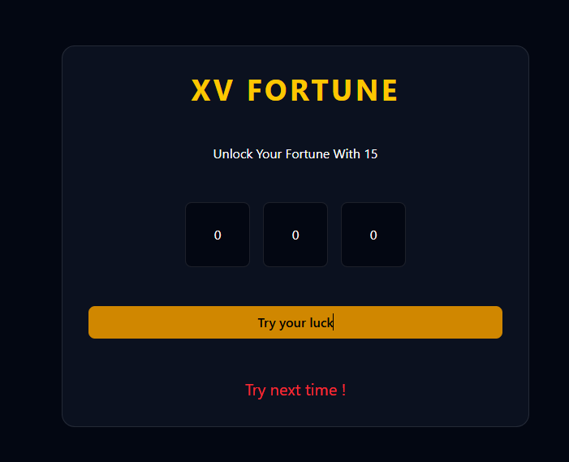

# XV Fortune - Sum to 15 Game


A fun and interactive number puzzle game built with **React**, **Vite**, **TypeScript**, **Taolwind CSS*.
## 🎮 Gameplay

- Three boxes display random numbers.
- Your goal is to obtain the number combination that adds uo to get exactly 15 .

## 🚀 Features

- Built with React for a dynamic user interface
- Powered by Vite for fast development and performance
- Written in TypeScript for better type safety and maintainability
- Simple, clean, and responsive design
- Lightweight and beginner-friendly project

## 🛠️ Tech Stack

- React
- Vite
- TypeScript
- Taiwind

## 📦 Installation

```bash
git clone https://github.com/iAnamikaSingh/game-XV-Fortune.git
cd game-XV-Fortune
npm install
npm run dev
